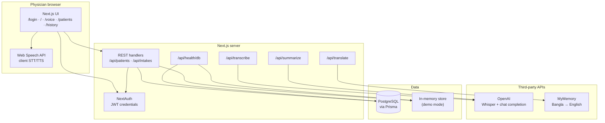

# SHUNO — Voice-enabled clinical assessment (UHC Bangladesh prototype)

**SHUNO** helps Union Health Complex–style physicians **register patients**, run **voice-first intake** in **Bangla or English**, optionally **translate Bangla to English**, and generate an **AI-assisted clinical summary** with **approve-before-save** storage. The shipped stack is **Next.js 14** (App Router), **NextAuth**, **Prisma**, and **PostgreSQL**, with optional **OpenAI** (Whisper + GPT-style summary), browser **Web Speech API**, and **demo mode** (no database) for quick setup.

---

## Prerequisites

| Requirement | Notes |
|-------------|--------|
| **Node.js 18+** | LTS recommended (matches Next.js 14). |
| **npm** | Bundled with Node. |
| **PostgreSQL 14+** | **Only if you are not using demo mode** (local install, Docker, or hosted e.g. [Neon](https://neon.tech)). |
| **Chromium / Firefox / Safari (current)** | **Web Speech API** is used for in-browser speech; behavior varies by browser and OS. |
| **OpenAI API key** | **Optional** — without it, transcription/summary use placeholders or configured fallbacks (see [Known limitations](#known-limitations)). |

**Goal:** A developer who has never seen the repo can **clone, configure, and run locally in under 15 minutes** using either path below without asking the team.

---

## Local setup — fast path (demo mode, ~5 minutes)

Use this when you want the app **without installing Postgres**. Data is **in-memory** and is **lost when the dev server stops**.

1. **Clone and install**

   ```bash
   git clone https://github.com/rajivkalyan/cs584.git
   cd cs584
   npm install
   ```

2. **Environment**

   ```bash
   cp .env.example .env
   ```

   Edit `.env` and set at least:

   - **`NEXTAUTH_SECRET`** — run `openssl rand -base64 32` and paste the value.
   - **`NEXTAUTH_URL`** — `http://localhost:3000` (or the port Next prints).
   - **`UHC_DEMO_MODE=true`** — forces demo mode (in-memory store + demo login) even if `DATABASE_URL` is still present in `.env` (see [`lib/runtimeEnv.js`](lib/runtimeEnv.js)).

   Optionally set **`OPENAI_API_KEY`** for real Whisper transcription and summaries.

3. **Run**

   ```bash
   npm run dev
   ```

4. Open **http://localhost:3000** (or the URL Next prints) → **Login** → use **[Demo-mode physician](#test-users--roles)** credentials.

---

## Local setup — full path (PostgreSQL, ~15 minutes)

1. **Clone and install** (same as step 1 above).

2. **Create a database** (example name `uhc_voice`):

   ```bash
   createdb uhc_voice
   ```

   (Use `psql`, a GUI, or Docker if you prefer.)

3. **Environment**

   ```bash
   cp .env.example .env
   ```

   Set:

   - **`DATABASE_URL`** — e.g. `postgresql://YOUR_USERNAME@localhost:5432/uhc_voice`
   - **`NEXTAUTH_SECRET`** — `openssl rand -base64 32`
   - **`NEXTAUTH_URL`** — `http://localhost:3000`
   - **`UHC_DEMO_MODE=false`** (or remove that line)

   Optional: **`OPENAI_API_KEY`**, **`UHC_DEMO_FALLBACK`**, **`SEED_PASSWORD`** (see [Environment variables](#environment-variables)).

4. **Apply schema and seed the physician user**

   ```bash
   npx prisma db push
   npm run db:seed
   ```

5. **Run**

   ```bash
   npm run dev
   ```

6. Sign in with **[Seeded physician (PostgreSQL)](#test-users--roles)** credentials.

---

## Environment variables

| Variable | Required | Purpose |
|----------|----------|---------|
| `NEXTAUTH_SECRET` | **Yes** | Secret for signing sessions/JWT (`openssl rand -base64 32`). |
| `NEXTAUTH_URL` | **Yes** | App origin: `http://localhost:3000` locally; production URL **without** a trailing slash. |
| `DATABASE_URL` | **Yes for Postgres mode** | PostgreSQL connection string. If unset and demo mode is not forced, see [`useDemoMode`](lib/runtimeEnv.js). |
| `UHC_DEMO_MODE` | No | `true` → in-memory data + demo credentials. Use `false` or unset with a real database. |
| `OPENAI_API_KEY` | No | Whisper (`/api/transcribe`) and summary (`/api/summarize`); fallbacks if missing. |
| `UHC_DEMO_FALLBACK` | No | When enabled (default in dev unless set to `false`), `/api/transcribe` may return demo placeholder text on network/OpenAI failures instead of a hard error. |
| `UHC_DEMO_EMAIL` | No | Demo login email when `UHC_DEMO_MODE=true` (default `physician@uhc.demo`). |
| `UHC_DEMO_PASSWORD` | No | Demo login password (default `uhc-demo-2026`). |
| `UHC_DEMO_NAME` | No | Display name for the demo user (default `UHC Demo Physician`). |
| `SEED_PASSWORD` | No | Password for the seeded DB user `physician@uhc.demo` when running `npm run db:seed` (default `uhc-demo-2026`). |

**Neon (pooled):** append **`&pgbouncer=true`** to `DATABASE_URL` for Prisma + PgBouncer.

**Never commit `.env`.** Commit only **`.env.example`** (placeholders).

---

## Test users & roles

The shipped app exposes **one application role**: **physician** (`User` in Prisma). There is **no** separate admin or nurse account type.

| Mode | Role | Email | Password | Notes |
|------|------|-------|----------|--------|
| **Demo mode** (`UHC_DEMO_MODE=true`) | Physician | `UHC_DEMO_EMAIL` (default **`physician@uhc.demo`**) | `UHC_DEMO_PASSWORD` (default **`uhc-demo-2026`**) | No database seed required. Data is not persisted across server restarts. |
| **PostgreSQL** (after `npm run db:seed`) | Physician | **`physician@uhc.demo`** | **`uhc-demo-2026`**, or the value of **`SEED_PASSWORD`** if you set it before seeding | Run `npx prisma db push` then `npm run db:seed` once per database. |

If you already had an older seeded email in Postgres, run **`npm run db:seed`** again after pulling these defaults (and remove stale `User` rows in Prisma Studio if you no longer need them).

---

## System architecture (shipped)



**Narrative:** The physician uses the **browser** for pages and optional **local speech**. The **Next.js server** authenticates requests, persists **patients** and **intakes** (Postgres or in-memory), and calls **OpenAI** and **MyMemory** from API routes. **Demo mode** skips Postgres for auth and CRUD and keeps state in memory.

---

## Stack (reference)

- **Next.js 14** (App Router), **NextAuth** (credentials + JWT)
- **Prisma** + **PostgreSQL**
- **Web Speech API**; optional **OpenAI**; **MyMemory** via [`/api/translate`](app/api/translate/route.js)
- **Netlify** ([`@netlify/plugin-nextjs`](package.json))

---

## Scripts

| Command | Description |
|---------|-------------|
| `npm run dev` | Development server |
| `npm run build` | `prisma generate` + production build |
| `npm run start` | Run production build locally |
| `npm run db:push` | Apply `schema.prisma` to the database |
| `npm run db:seed` | Seed default physician (`physician@uhc.demo`) |
| `npm run lint` | ESLint |

---

## Deploy on Netlify

1. Connect the repo; build uses **`netlify.toml`** and **`scripts/netlify-build.cjs`** (`db push`, `db seed`, `npm run build`).
2. **Site settings → Environment variables:** set at least `DATABASE_URL` (Build + Functions), `NEXTAUTH_SECRET`, `NEXTAUTH_URL`; set **`UHC_DEMO_MODE=false`** (or unset) when using Postgres.
3. Redeploy after env changes.

**Smoke test:** `https://YOUR_SITE.netlify.app/api/health/db` — expect `demoMode: false` and `prisma: "ok"` when the database is connected.

---

## Main routes

| Path | Description |
|------|-------------|
| `/login` | Physician sign-in |
| `/` | Dashboard |
| `/voice` | Voice intake: patient search, register, free-form or guided |
| `/patients` | Patients and intakes |
| `/history` | Past intakes |

**API:** `/api/auth/*`, `/api/patients`, `/api/intakes`, `/api/translate`, `/api/transcribe`, `/api/summarize`, `/api/health/db`.

---

## Project layout

- `app/` — App Router pages and API routes
- `components/` — UI (`VoiceCapture`, `GuidedIntake`, `AppShell`, …)
- `context/` — `LanguageProvider`, `StoreProvider`
- `lib/` — Auth, Prisma/db helpers, demo detection, copy, API client
- `prisma/` — `schema.prisma`, `seed.js`
- `_legacy/` — Old Deno prototype (**not** used by this app)
- `docs/` — TDSOW (`TDSOW-pd.txt`), Part 1/3 handoff, tech-debt templates; `docs/course/` holds peer-review drafts and checkpoints (not needed to run the app)
- `scripts/` — Netlify build (`netlify-build.cjs`), GitHub tech-debt helper (`setup-tech-debt-issues.sh`), optional project-board sync (`sync-project-board.sh`)

---

## Known limitations

- **Not HIPAA-compliant** and **not** a production medical record system; **do not** use with real PHI.
- **Single role** (physician): no multi-tenant org, nurse/admin roles, or audit log of clinical access.
- **Speech and translation** depend on **browser capabilities**, optional **OpenAI**, and a **public MyMemory** endpoint for Bangla→English — inappropriate for sensitive clinical content without a different design and consent model.
- **No automated integration/E2E test suite** in-repo beyond **`npm run lint`**.
- **`_legacy/`** remains for history but is **outside** the shipped Next.js build path.

---

## License / course use

Private academic / prototype — adjust for your institution as needed.
