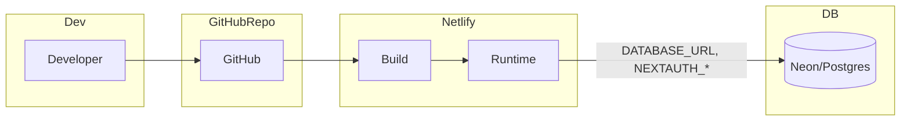
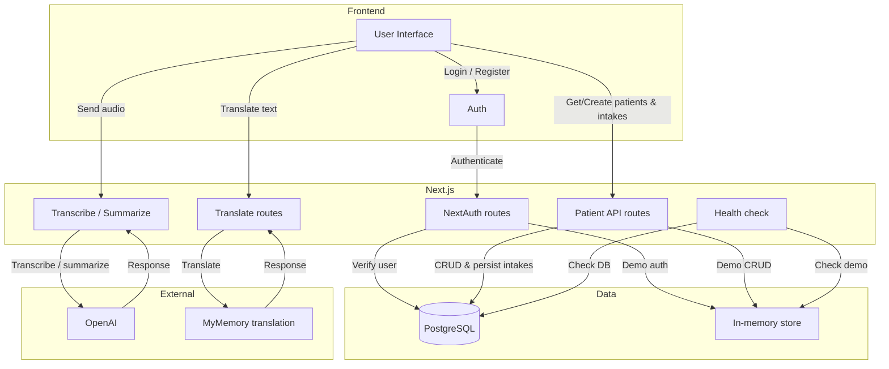

# Architecture diagrams (Mermaid)

PNG exports embedded in the main **[`README.md`](../README.md)** (system architecture section):

- [`docs/images/architecture-deployment.png`](images/architecture-deployment.png)
- [`docs/images/architecture-application.png`](images/architecture-application.png)

Below are **editable** sources. Render on GitHub or in VS Code with a Mermaid preview extension.

---

## 1. Deployment: Dev → GitHub → Netlify → Neon/Postgres

---

## 2. Application: UI → Next.js routes → Data & external APIs

**Note:** In **demo mode**, auth and patient/intake traffic use the **in-memory** path; with **Postgres**, NextAuth and APIs use **PostgreSQL** (the diagram shows both targets for clarity).
